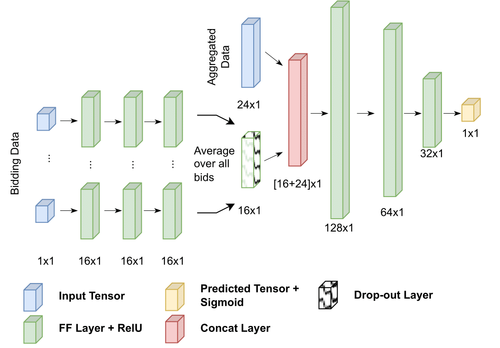
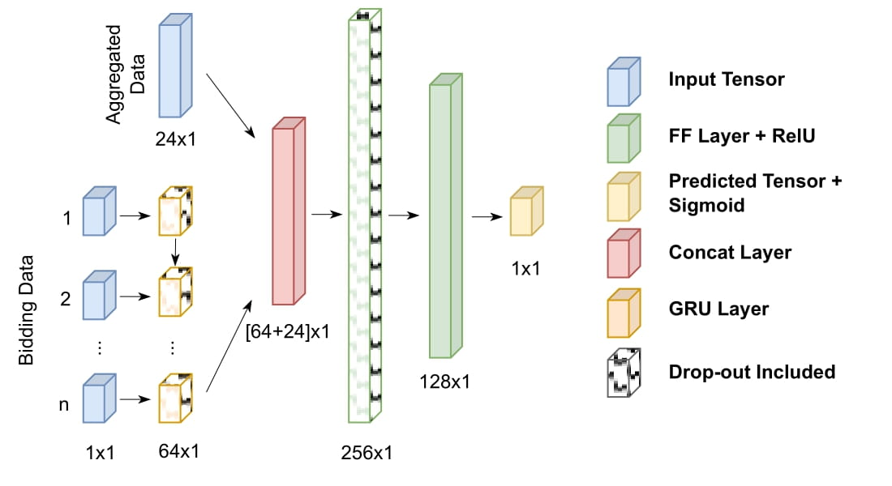
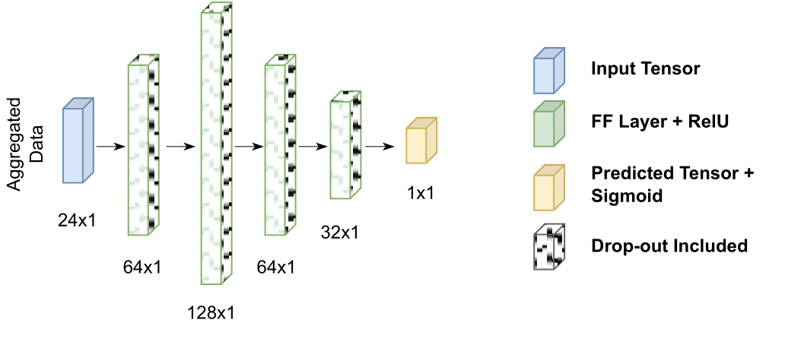
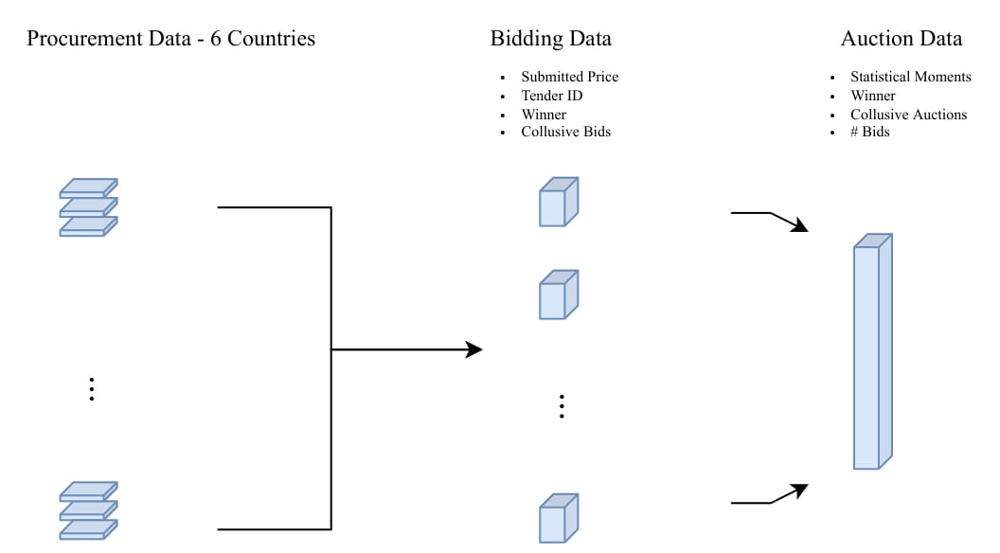

# Cartel Detection: A Neural Network Approach
> This repo contains code for cartel detection using 3 different type of neural network models:

<div style = "display: flex; justify-content: center;">
     
     
     
</div>

## Files
- files containing the models used for the results in the paper:
    - [logisticregression_analysis](./logisticregression_analysis.py)
    - [mlp_analysis](./mlp_analysis.py)
    - [recurrent_analysis](./recurrent_analysis.py)
    - [nested_mlp_analysis](./nested_mlp_analysis.py) (Also uses: [training_function](./training_function.py))

- Discriptive statics are gatherd in [exploratory_analysis](./exploratory_analysis.py)

- Data preprocessing can be found in [data_preprocessing](./data_preprocessing.py)

- [tensorflow_helpers](./tensorflow_helpers.py) contains a function to plot results of a fitted tensorflow model.

- Images of the results can be found in the `Images` folder ([Images](./images))

## Installation
To install the requirements for this project, run the following code in your terminal.
If you want, you can make a virtual environment using:
```bash
python -m venv venv
```

Then activate the environment using:
```bash
./venv/Scripts/activate
```

And finally install the requirements using:
```python
pip install -r requirements.txt
```

To deactivate the virtual environment, you can use:
```bash
deactivate
```

## Data
> Data used for this project is explained in the image below. More details can be found in the paper.

